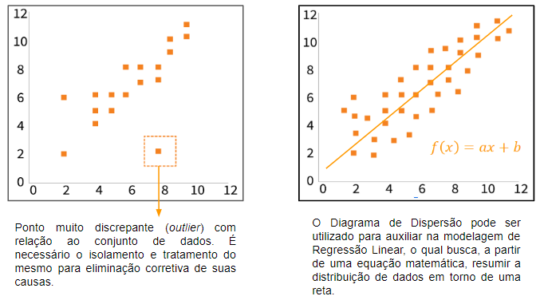

# Atividade R Markdown e Mineração de Texto

``` {r blibiotecas ,include=FALSE} 
#pacotes a serem instalados
#install.packages("tm")
#install.packages("wordcloud")
#install.packages("readr")
#install.packages("syuzhet")
#install.packages("DT")
library(tm)
library(wordcloud)
library(readr)
library(syuzhet)
library(DT)
```

## Atividade 1 - Nuvem de palavra do discurso “Eu tenho um sonho” de Martin Luther King Jr. Também plote as palavras mais frequentes.
```{r atividade1,fig.width= 6, fig.height=6, warning=FALSE}
discurso = read.delim("discurso_mlk.txt", header=FALSE)


VS <- VectorSource(discurso)
corpus <- Corpus(VS)

#removendo minúsculos
corpus <- tm_map(corpus, content_transformer(tolower))

#removendo pontuação
corpus <- tm_map(corpus, removePunctuation)

#removendo espaços extras em branco
corpus <- tm_map(corpus, stripWhitespace)

#remover numeros
corpus <- tm_map(corpus, removeNumbers)

#remover stopwords
corpus <- tm_map(corpus, removeWords, stopwords('portuguese'))

#converter para o formato de matrix

tdm <- as.matrix(TermDocumentMatrix(corpus))

#Fornecer as frequencias ordenadas de cada palavra

fre <- sort(rowSums(tdm), decreasing = TRUE)

#escolhedo um subconjunto dos dados
aux<- subset(fre, fre>2)

#plotar gráfico de barras
barplot(aux, las=2, col = rainbow(10))


wordcloud(corpus, min.freq = 1, max.words = Inf,
          random.order = FALSE, rot.per = 0.35,
          colors=brewer.pal(5,"Dark2"))

```


## Atividade 2- Nuvem de palavra a partir dos twitters sobre "Brasil". Também faça uma análise de sentimentos com relação a esses twitters coletados.

``` {r , warning=FALSE}
#tweets <- search_tweets("Brasil", n=500, lang="pt") a pesquisa foi colocada em brasilTweets.csv


#tweetsDF <- load("datTweetsBrasil.Rda")
tweetsDF <- readRDS(file="datTweetsBrasil.Rda")
tweets_texto <-paste(tweetsDF$text, collapse = " ")


wordcloud(width=800, height=800,
  tweets_texto, min.freq = 1, max.words = 100,
          random.order = FALSE, rot.per = 0.35,
          colors=brewer.pal(50,"Dark2")) #não entendi os parametros de tamanho, nao achei na internet muito sobre


#pontuando os tweets
tweetsDF <- tweetsDF$text
s<-get_nrc_sentiment(tweetsDF)

#plotando grafico com sentimentos
barplot(colSums(s), las=2, col=rainbow(10),
        ylab = "Contagem", main = "Sentimentos em relação a Brasil")


```


## 3- 5 equações complexas usando Latex.

#### Equação do algoritmo ELO (rating):
$$E\alpha = \frac{1}{1+10\frac{R\beta - R\alpha}{400}}$$

#### Derivada
$$f'(x) = \frac{df}{dx}=\lim_{x\rightarrow a}\frac{f(x)-f(a)}{x-a}$$

#### Série de Taylor
$$f(x) =\sum_{n=0}^{\infty}\frac{f^{(n)}(a)(x-a)^n}{n!}$$

#### Determinando CPI de Processador:
$$CPI = \sum_{n}^{i=1}(CPIi x Li)$$

#### Lei de Faraday - Lenz
$$\oint E\cdot ds = -\frac{d\Phi B}{dt}$$
## 4 - 2 Figuras relacionadas a ciência de dados e 2 tabelas (dica:  use datatable() do pacote DT).

#### Figuras:



#### Tabela 1
```{r}
datatable(iris)
```

#### Tabela 2
```{r}
datatable(mtcars)
```


## 5 -5 referências usando o BibTex.
@araujo2013metodos
@allaire2012rstudio
@dhar2013data
@verzani2011getting
@redmalm2014holy